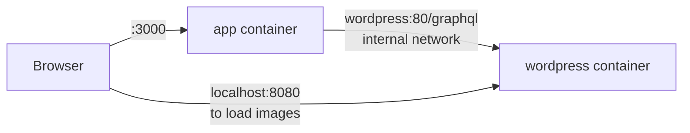
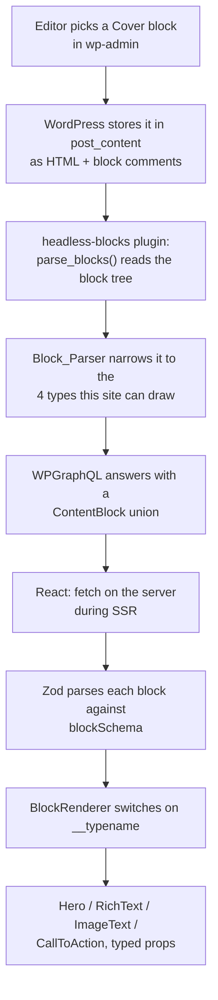

# A personal site on headless WordPress

[](https://codespaces.new/mrboyenrey/wp-headless)
[](https://mrboyenrey.github.io/wp-headless/)

WordPress holds the content. A server-rendered React application renders it. An
editor assembles a page by picking blocks from the standard block editor, and
the front end turns each block into a typed component. No developer involved,
no rebuild, no deploy.

The interesting part is the seam between the two systems, so that is where the
comments are and that is what the section below is about.

> **Reviewing or presenting this?** `docs/` holds a self-contained 15-slide
> walkthrough: plain HTML and CSS, no build step and no JavaScript. Open
> `docs/index.html` directly in a browser, or see it on GitHub Pages. It works as
> a presentation and reads equally well as documentation on its own.

---

## Getting it running

**Everything runs in Docker.** You need Docker Desktop and nothing else. No
Node, no PHP, no MySQL, and no XAMPP.

### One command

```bash
bash .devcontainer/setup.sh
```

That starts all four containers, installs WordPress, activates the plugins,
creates the administrator and editor accounts, seeds the demo content and
compiles the React application. It is idempotent: running it again rebuilds the
demo content, skips the WordPress install if WordPress is already there, and
leaves an existing editor account alone.

The first run takes a few minutes because the images have to download. When it
finishes the site is already up at <http://localhost:3000>. There is nothing to
start afterwards.

### The same thing by hand

```bash
cp .env.example .env

# Builds the application image and starts all four containers.
docker compose up -d --build

# WordPress core, the GraphQL plugin, and this project's plugin
docker compose run --rm wpcli core install \
  --url="http://localhost:8080" \
  --title="Boien Reyes" \
  --admin_user=admin --admin_password=admin \
  --admin_email=admin@example.com --skip-email
docker compose run --rm wpcli plugin install wp-graphql --activate
docker compose run --rm wpcli plugin activate headless-blocks
docker compose run --rm wpcli plugin activate headless-redirect

# An editor account alongside the administrator one, so the site can be handed
# over without giving away an admin login. Skip this line if it already exists.
docker compose run --rm wpcli user create editor editor@example.com \
  --role=editor --display_name="Editor" --user_pass=editor

# Content to look at
docker compose run --rm wpcli eval-file /seed/seed.php
```

### GitHub Codespaces

Click the badge at the top of this file, or **Code → Codespaces → Create
codespace on main**. The devcontainer runs `.devcontainer/setup.sh` for you.

> **It is ephemeral.** A codespace suspends after roughly 30 minutes idle and
> the forwarded URLs change whenever you restart it. Excellent for reviewing;
> not a deployment.

### Addresses

| Service | Address | Credentials |
| --- | --- | --- |
| The site | http://localhost:3000 | none |
| WordPress admin | http://localhost:8080/wp-admin | `admin` / `admin` (administrator) |
| WordPress admin | http://localhost:8080/wp-admin | `editor` / `editor` (editor role) |
| GraphiQL (when logged in) | http://localhost:8080/graphql | none |
| phpMyAdmin | http://localhost:8081 | `root` / `root` |

WordPress's own front end is closed. Opening <http://localhost:8080> redirects to
the application, so the active WordPress theme is never served to a browser -
only `/wp-admin`, `/graphql` and uploaded files remain reachable on that port.
See `wp-plugins/headless-redirect/`.

The credentials are throwaway values for a container bound to localhost. They
are not secrets and not for anything else, but change them before pointing
a public address at this.

### The commands you will actually use

| Goal | Command | Run from |
| --- | --- | --- |
| Start everything | `docker compose up -d` | repository root |
| Start, rebuilding the app image | `docker compose up -d --build` | repository root |
| Stop everything (keeps your data) | `docker compose down` | repository root |
| Pause, then resume quickly | `docker compose stop` / `start` | repository root |
| What is running? | `docker compose ps` | repository root |
| Tail one service's logs | `docker compose logs -f app` | repository root |
| Rebuild the demo content | `bash .devcontainer/setup.sh` | repository root |

> **`docker compose down -v` deletes the database and all content.** Plain
> `down` keeps it. The data lives in Docker volumes, not in this folder, so
> moving or re-cloning the project does not affect it.

### Developing with hot reloading

The `app` container runs the **production** build (compiled, minified, no
watcher) because that is what a reviewer should be looking at. To edit React
with hot reloading, stop that container and run the app on the host instead.
This is the only workflow that needs Node:

```bash
docker compose stop app
cd app && npm install && npm run dev
```

Reloading is instant, and the host app talks to the same WordPress container on
`localhost:8080`. Put it back in Docker with `docker compose up -d app`.

Development and production are one file, `app/server.js`, switched by `--prod`.

### Two addresses for one container

Worth knowing before you touch the configuration:



The application fetches content **server-side, inside the Docker network**, so it
addresses WordPress as `wordpress` on port 80. Images in the HTML are loaded by
the **browser**, which sits outside that network and cannot resolve that name, so
`WP_URL` stays `http://localhost:8080`.

Getting these the wrong way round is the classic way to break a containerised
SSR app: it works locally where everything is `localhost`, then every image 404s
once it is containerised.

### If something goes wrong

| Symptom | Cause |
| --- | --- |
| `npipe ... not found` | Docker Desktop is not running |
| `port 3000 is already in use` | An earlier dev server is still alive. Stop it, or run `PORT=3001 npm run dev` |
| `ERR_CONNECTION_REFUSED` on :3000 | The Node server is not running. Docker being up is not enough |
| A section is missing from a page | The content notice on the page names the block and the reason |
| The WordPress theme is visible | `APP_URL` is not the forwarded address, so the redirect points at a dead port. Re-run `.devcontainer/setup.sh` |
| Images broken inside a Codespace | `WP_URL` is not the forwarded address. Re-run `.devcontainer/setup.sh` |
| WordPress redirects to localhost | Same cause as above |

---

## The seam

This is the whole exercise, so it is worth being precise about the path a single
block takes.



Four decisions in that chain are worth defending.

### 1. The translation happens in WordPress, not in React

`post_content` is not data. It is HTML with the structure encoded in comments:

```html
<!-- wp:cover {"url":"…","dimRatio":62} -->
<div class="wp-block-cover">…<h1>Heading</h1><p>Sub</p>…</div>
<!-- /wp:cover -->
```

A front end handed that can only either echo it or scrape it. So the plugin
reads WordPress's own parsed block tree (`parse_blocks()`) and republishes it as
real fields. The paragraph's words live in `innerHTML` rather than in attributes,
which is why the parser reads a couple of values back out of the markup, because
that is the only place they exist.

### 2. A GraphQL union, not one loose type

Every renderable block is its own object type, joined by `ContentBlock`:

```graphql
union ContentBlock = HeroBlock | RichTextBlock | ImageTextBlock | CallToActionBlock
```

The alternative, one `Block` type with a `type` string and every field optional,
pushes the problem to the consumer, where every component has to decide which
fields it can trust. A union means the question is settled by the schema, and it
mirrors the TypeScript union member for member.

### 3. The data is parsed, not trusted

`app/src/blocks/schema.ts` is the contract. WordPress can gain a field, lose one,
or send a value nobody expected, and none of that can reach a component:

```ts
export const blockSchema = z.discriminatedUnion('__typename', [
  heroBlockSchema, richTextBlockSchema, imageTextBlockSchema, callToActionBlockSchema,
]);
```

Types come *from* the schema (`z.infer`), so there is one definition rather than
a type declaration that can drift from its validator.

### 4. Adding a block type is enforced by the compiler

1. Register the type in `wp-plugins/headless-blocks/includes/class-schema.php`
2. Add it to `blockSchema`
3. Add a component and a `case` in `BlockRenderer.tsx`

Step 3 cannot be forgotten. `BlockRenderer` ends with:

```ts
default: {
  const unhandled: never = block;
  return null;
}
```

If a block type is added to the union and not handled, that assignment stops
compiling. The failure is at build time rather than as a blank space on a page.

---

## What happens when the content is wrong

The realistic failure in a headless setup is not a crash. It is quiet omission:
an editor adds a block, the front end has no component for it, and the content
is simply absent. Nobody notices for a month.

There are two distinct ways that can happen, and they are handled separately:

| Situation | What happens | Where it shows |
| --- | --- | --- |
| A block type with no component here (e.g. `core/list`) | Skipped by the plugin's allow-list; the page renders normally | Reported as `skippedBlocks` in GraphQL and in the content notice on the page |
| A block that claims to be a known type but fails validation | Dropped by Zod; the other blocks still render | Reported in the page's content notice and in the server log |

Neither one takes the page down. Both are visible. The seeded Home page contains
a `core/list` on purpose so this is demonstrable rather than merely claimed.

The content notice rendered at the bottom of a page is scaffolding for this
exercise. In a real project the same information belongs in CI, failing the
build when WordPress and the front end disagree.

---

## Why WPGraphQL rather than the REST API

The REST API was the other option, and it would have been less work. The reason
it is the wrong tool here is specific rather than general:

- **REST returns rendered HTML for content.** Block structure arrives as a single
  string, so the typed seam this exercise is about has to be reconstructed by
  parsing HTML in the front end, which moves the exact problem to the wrong side.
- **A union is expressible in GraphQL.** The contract between the two systems is
  the thing being graded, and GraphQL can state it. REST cannot.
- **The schema is introspectable.** The front end's contract can be inspected and
  generated from, rather than agreed in a wiki page.
- **`_fields` is not a substitute.** Trimming REST responses controls size; it
  does not give you structure.

The cost is a plugin dependency and a query language. For a page built out of
typed blocks, that is the right trade.

---

## The content model

| Type | Its own fields | Where it is rendered |
| --- | --- | --- |
| Page | title, slug, SEO description, ordered blocks | `/` and any page slug |
| Post | title, date, excerpt, cover image, ordered blocks | the `/blog` index, then its own slug |
| Service | title, short description, icon, optional price, image, blocks | the `/services` index, then `/services/<slug>` |
| Menu | label plus target, ordered | the header navigation |

Pages and posts come from WordPress. The Service type and the SEO description
are registered in `wp-plugins/headless-blocks/includes/class-content-types.php`,
as registered post meta rather than an ACF field group, so the field definitions
live in code the front end can read rather than in a database row.

**The only addresses this application invents are `/blog` and `/services`.**
Every other route is a slug WordPress owns, resolved with `nodeByUri(uri:)`, so
there is no list of pages anywhere in the code. The two archive paths are the
exception because an archive has no slug to look up: WordPress is not serving
one.

The navigation is a real WordPress menu, so ordering and nesting are the
editor's to control. A menu location is declared by the plugin because there is
no theme to declare one, and WPGraphQL will not expose a menu that is not
assigned to a registered location.

---

## The block library

| WordPress block | GraphQL type | React component | Props |
| --- | --- | --- | --- |
| `core/cover` | `HeroBlock` | `Hero.tsx` | `heading`, `subheading`, `overlayOpacity`, `image` |
| `core/heading` | `HeadingBlock` | `Heading.tsx` | `level`, `html` |
| `core/paragraph` | `RichTextBlock` | `RichText.tsx` | `html` |
| `core/media-text` | `ImageTextBlock` | `ImageText.tsx` | `heading`, `bodyHtml`, `mediaPosition`, `image` |
| `core/buttons` | `CallToActionBlock` | `CallToAction.tsx` | `label`, `url`, `opensInNewTab` |

Anything else is reported as skipped rather than rendered as raw HTML, and the
block inserter is restricted to the same list (`includes/class-editor.php`), so
a block the front end cannot draw cannot be inserted in the first place.

---

## What I wrote, and what I assembled

**Assembled** (starters, images and plugins, none of it mine):

- `wordpress:php8.3-apache`, `mysql:8.0`, `phpmyadmin`, `wordpress:cli-php8.3`:
  official Docker images
- **WPGraphQL 2.23.1**: free plugin from wordpress.org, provides the GraphQL
  endpoint and the type registry this project extends
- React 19.3, Vite 8.3, Tailwind CSS 4.3, Zod 4.6, TypeScript 7.0
- `@vitejs/plugin-react`, `@tailwindcss/vite`

**Written for this exercise:**

- `docker-compose.yml`, `.env.example`: the stack
- `wp-plugins/headless-blocks/`: the plugin. `Block_Parser` (Gutenberg tree →
  typed blocks), `Schema` (GraphQL types, union, fields), `Content_Types` (the
  Service type, its fields and the SEO description) and `Editor` (keeps the
  block inserter to the renderable library)
- `wp-plugins/headless-redirect/`: closes WordPress's own front end so the
  active theme is never served to a browser
- `seed/seed.php`: reproducible demo content, including the placeholder images
  drawn with GD so no binaries are committed
- `app/server.js`: the SSR server (dev and production in one file)
- `app/src/blocks/`: the schema, the renderer and the five components
- `app/src/views/`: one view per route kind, plus the shared block list
- `app/src/wp/`: the GraphQL client and the page loader
- `app/src/entry-server.tsx`, `entry-client.tsx`, `App.tsx`: SSR plumbing
- `app/src/components/`, `config.ts`, `index.css`, `vite.config.ts`, `tsconfig.json`

**No starter template was used.** The app was scaffolded by hand rather than via
`create-vite`, so there is no generated boilerplate in it that I would have to
hand-wave at.

---

## Deliberate choices worth asking about

**No router.** Every link is a plain `<a>`. The application is server-rendered
per URL and WordPress owns the URLs, so following a link is a full page load.
Adding React Router would mean duplicating routing responsibility for no gain.
React Router 7's framework mode would be the right call if client-side
navigation, loaders or nested layouts were wanted.

**`dangerouslySetInnerHTML` in `RichText` and `ImageText`.** Deliberate, and
narrowly scoped. The HTML is authored by a logged-in editor and sanitised by
WordPress on save, and the alternative is writing an HTML-to-JSX converter.
Nothing user-submitted reaches it. The trust boundary is WordPress, not the
visitor.

**A `switch` in `BlockRenderer` rather than a lookup table.** A
`Record<BlockType, Component>` looks tidier, but the call site cannot be typed
without a cast, and a cast is exactly what would let a mismatched prop through.
The `switch` lets TypeScript narrow the union for free.

**Configuration is split across two files on purpose.** `config.ts` is imported
by components so it must not touch `process.env`, which would break in the
browser. Anything server-only lives in `wp/client.ts`, which components import
with `import type` so it is erased from the browser bundle.

---

## Notes from the build

Four things cost real time and are worth recording.

**The wp-cli container could not write to the shared volume.** The `wordpress:cli`
image is Alpine, where `www-data` is uid 82; the `wordpress:php8.3-apache` image
is Debian, where it is uid 33. The volume is owned by 33, so `plugin install`
failed with "Could not create directory". Fixed by pinning the CLI service to
`user: "33:33"`.

**Page URIs were query strings.** WordPress ships with plain permalinks, so every
page's canonical URI was `/?page_id=13`. That left the front end nothing to route
on, and the navigation derived from page URIs was a list of query strings. Fixed
in the seed by setting `permalink_structure` to `/%postname%/` and flushing
rewrite rules.

**A block authored in the editor parsed as empty.** `$block['innerHTML']` is not
the rendered markup for a block that contains other blocks: WordPress keeps the
nested content in `innerBlocks` and `innerHTML` holds only the markup around it.
An editor-authored Media & Text block therefore arrived with its content column
empty, and the parser dropped it as "nothing to render". The seed content hid
this, because it writes the heading and paragraph inline, the one shape where
`innerHTML` happens to be complete. Fixed by reading container blocks through
`render_block()`.

**The active theme was reachable at the WordPress address.** Not a bug in either
system, but a trap: two front ends on one body of content drift, and "the layout
is broken" turns out to mean "I was looking at the wrong port". Fixed with the
`headless-redirect` plugin, which sends WordPress's front end to the application.

---

## Where I stopped

Working end to end, verified: WordPress → plugin → GraphQL union → Zod → typed
components → SSR HTML → hydration with no console errors and no failed requests.
Four pages, three posts, three services, five block types, a WordPress-managed
menu, unknown blocks reported, and a production build serving real
server-rendered HTML.

Routes verified: `/`, `/about`, `/contact`, `/blog`, `/services`,
`/services/<slug>`, a post slug, and a real 404 for anything else. A service
requested at the root (`/headless-front-ends` rather than
`/services/headless-front-ends`) correctly 404s.

Not done, in the order I would do it next:

1. **Deployment.** Everything here runs locally. Both applications still need
   somewhere to live, and that is the largest gap between this and the brief.
2. **Generated TypeScript types.** The schema could be introspected and
   `BlockRenderer`'s union generated from it, so the WordPress schema is the
   single source of truth rather than the Zod file mirroring it by hand.
3. **Draft preview**, so an editor sees an unpublished page before it goes out.
4. **Caching.** Every request queries WordPress. A short-lived cache keyed by
   path, invalidated when WordPress publishes, removes that.
5. **Tests.** The parser and the loader are the pieces with real logic in them:
   feed the parser block markup and assert the payload, including the
   unknown-block case.
6. **A media proxy.** Images are served from `localhost:8080` and the app from
   `localhost:3000`; in production those would be one origin, or the image host
   would be configured as a remote pattern.

---

## Ports, in one place

| Port | Thing |
| --- | --- |
| 3000 | React SSR app |
| 8080 | WordPress |
| 8081 | phpMyAdmin |

Ports 8000/8001 are avoided because another project in this workspace already
uses them.

---

## Publishing the walkthrough to GitHub Pages

The walkthrough in `docs/` is static, so it needs no build step. Two things
matter when handing it to GitHub Pages:

1. **The folder must be called `docs`.** The "deploy from a branch" setting only
   serves the repository root or a `/docs` folder. An arbitrarily named folder
   like `/presentation` is not an option.
2. **`.nojekyll` must be present.** Without it, Pages runs the folder through
   Jekyll, which silently ignores files beginning with an underscore and can
   fail for reasons that are hard to see.

```bash
git init
git add .
git commit -m "Headless WordPress: site, plugin, walkthrough"
gh repo create wp-headless --public --source=. --push

# serve docs/ from main
gh api -X POST repos/mrboyenrey/wp-headless/pages \
  -f "source[branch]=main" -f "source[path]=/docs"
```

It appears at `https://mrboyenrey.github.io/wp-headless/` after a minute or two.

Two gotchas worth remembering, both of which have already bitten the portfolio
project in this workspace:

- **`curl` the URL before believing a browser check.** Pages caches `index.html`
  hard, so a browser-based check can still be looking at the previous deploy.
- **With `build_type=workflow`, `gh api repos/<owner>/<repo>/pages/builds/latest`
  returns 404.** That is expected; use `gh run list` instead.
